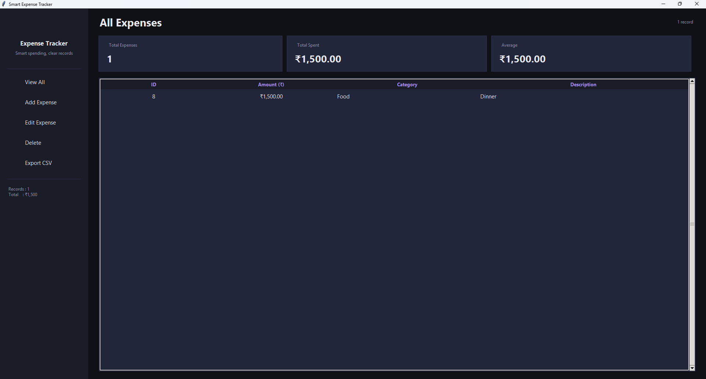

# Smart Expense Tracker

Smart Expense Tracker is a Python-based application that helps users manage their daily expenses efficiently using an SQLite database.

## Features

* Add Expenses
* View Expenses
* Update Expenses
* Delete Expenses
* Input Validation
* Export Expenses to CSV
* Formatted Expense Display

## Technologies Used

* Python
* SQLite3
* CSV Module

## Project Structure

```bash
SmartExpenseTracker/
│
├── main.py
├── database.py
├── expense.py
├── reports.py
└── expenses.db
```

## GUI Preview




## How to Run

1. Clone the repository
2. Open terminal in project folder
3. Run:

```bash
python main.py
```

## Future Improvements

* Search Expenses
* Total Expense Calculation
* Tkinter GUI
* Charts and Reports

## Author

Ankush Chandra
